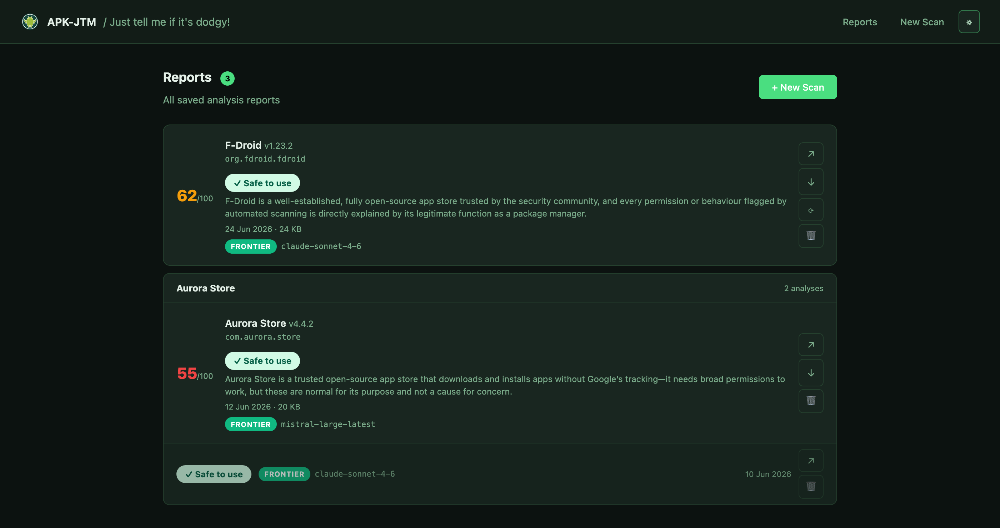
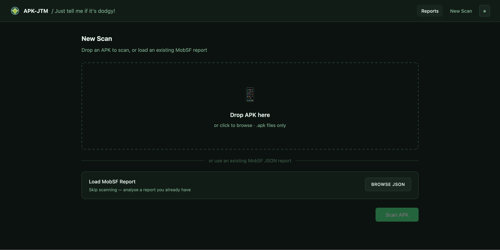

<p align="center">
  
</p>

# APK-JTM — Just tell me if it's dodgy!

[](https://github.com/f0dders/apk-jtm/releases)
[](LICENSE)
[](https://www.python.org/downloads/)

Analyses Android APKs using [MobSF](https://github.com/MobSF/Mobile-Security-Framework-MobSF) for static analysis and [APKiD](https://github.com/rednaga/APKiD) for packer/obfuscation detection, then passes the findings to an AI model to produce a plain-English security report — no pentesting background required.

Supports **local AI models** (Ollama, LM Studio) for fully offline use, and **cloud AI** (Claude, OpenAI, Gemini, and more) for maximum analysis quality.

---

<p align="center">
  
</p>

<p align="center">
  
</p>

---

## What it does

Drop an APK file onto the app. Within a few minutes you get a structured report covering:

| Section | What it tells you |
|---|---|
| **App context & reputation** | Is this a known app? Who made it? Is its reputation trustworthy? |
| **Executive summary** | Plain-English risk verdict: LOW / MEDIUM / HIGH / CRITICAL |
| **Top security findings** | Prioritised issues — permissions, secrets, code vulnerabilities |
| **Packer & obfuscation analysis** | Did APKiD find packers, anti-VM, or obfuscators? Are they malware-grade? |
| **Privacy concerns** | What personal data can this app access or collect? |
| **Network & data activity** | Where does the app send data? Flagged domains, trackers |
| **Geographic analysis** | Which countries host the servers? Strong privacy laws or state surveillance risk? |
| **Red flags** | Unambiguous signs of malicious behaviour or spyware |
| **Verdict & recommendations** | Clear actions: Install / Avoid / Monitor / Restrict |

Reports are saved as HTML and Markdown and browsable in the app's Reports tab. Multiple analyses of the same app are grouped together so you can compare results across AI models.

---

## Quick Start

> **TL;DR for experienced users:** install Python 3.12 and Docker, run MobSF in Docker, clone this repo, double-click the launcher for your OS.

### Step 1 — Install Python

You need Python 3.10 or newer. Python **3.12 is recommended** — it unlocks APKiD packer analysis.

Check if you have it:
```
python3 --version
```

If not, download from **https://www.python.org/downloads/**

> **Windows users:** during installation, tick **"Add Python to PATH"**

The launcher will offer to install Python 3.12 via your system's package manager (Homebrew on Mac, winget on Windows, apt/dnf/pacman on Linux) if it can't find a compatible version.

---

### Step 2 — Install Docker and start MobSF

MobSF runs locally in Docker — you don't need to know how Docker works, just have it installed.

#### 2a — Install Docker Desktop

Download from **https://www.docker.com/products/docker-desktop** and install it. Open Docker Desktop and leave it running in the background.

> **Windows:** you may be prompted to install WSL 2 during setup — follow the on-screen instructions.

#### 2b — Start MobSF

**Mac / Linux:**
```
mkdir -p ~/.mobsf
docker run -d --name mobsf -p 8000:8000 -v ~/.mobsf:/home/mobsf/.MobSF opensecurity/mobile-security-framework-mobsf:latest
```

**Windows:**
```
mkdir %USERPROFILE%\.mobsf
docker run -d --name mobsf -p 8000:8000 -v %USERPROFILE%\.mobsf:/home/mobsf/.MobSF opensecurity/mobile-security-framework-mobsf:latest
```

MobSF will download on first run (~1–2 GB) and start in the background. After 30–60 seconds, open **http://localhost:8000** to confirm it's running.

> **Why the `-v` flag?** This mounts a local folder into the container so MobSF's database — including your API key and scan history — persists across restarts.

#### 2c — Get your MobSF API key

1. Go to **http://localhost:8000**
2. Click the menu icon (top-right)
3. Select **REST API**
4. Copy the API key — you'll paste it into the setup wizard

> Your API key stays the same across restarts. You only need to copy it once.

**After first setup**, the launcher handles MobSF automatically — it starts the Docker container if it's not already running each time you launch the app.

---

### Step 3 — Launch the app

Double-click the launcher for your operating system:

| OS | File |
|---|---|
| **Mac** | `Start - Mac.command` |
| **Windows** | `Start - Windows.bat` |
| **Linux** | `Start - Linux.sh` |

**On first run**, the launcher will:
1. Check for Python 3.12 and offer to install it if needed
2. Create an isolated Python environment and install dependencies
3. Optionally install APKiD for packer analysis (Python 3.12 required)
4. Start MobSF via Docker
5. Open the app in your browser at `http://localhost:7842`

Subsequent launches are fast — the setup only runs once.

> **Mac:** first time only — right-click → **Open** → **Open** to bypass Gatekeeper. One-time step.

> **Linux:** if double-clicking doesn't work, right-click → Properties → tick **Allow executing as program**.

---

### Step 4 — Complete the setup wizard

On first visit, a 3-step wizard guides you through:

1. **MobSF** — confirm the URL (`http://localhost:8000`) and paste your API key
2. **AI provider** — choose offline (Ollama or LM Studio) or cloud
3. **Configure** — enter your model name or API key

Settings are saved in a local `.env` file. Change them later via the ⚙ icon.

---

## AI Provider Options

### Offline (no internet required)

| Provider | Setup | Recommended model |
|---|---|---|
| **Ollama** | Install from [ollama.com](https://ollama.com), run `ollama pull gemma3:27b` | `gemma3:27b` (~17 GB) |
| **LM Studio** | Install from [lmstudio.ai](https://lmstudio.ai), load a model, start the server | Any GGUF model |

**Apple Silicon recommendations:**
- `gemma3:27b` — strong all-round analysis, 17 GB RAM
- `qwen2.5-coder:32b` — excellent code analysis, 20 GB RAM
- `llama3.3:70b` — best reasoning, 40 GB RAM

### Cloud (best quality)

| Provider | Where to get a key | Notes |
|---|---|---|
| **Claude** (recommended) | [console.anthropic.com](https://console.anthropic.com) | Best analysis quality |
| **OpenAI** | [platform.openai.com/api-keys](https://platform.openai.com/api-keys) | GPT-4o and above |
| **Gemini** | [aistudio.google.com/app/apikey](https://aistudio.google.com/app/apikey) | Free tier available |
| **Groq** | [console.groq.com](https://console.groq.com) | Very fast, free tier |
| **Mistral** | [console.mistral.ai](https://console.mistral.ai) | Strong EU-based option |
| **OpenRouter** | [openrouter.ai/keys](https://openrouter.ai/keys) | One key, 100+ models |

> **OpenRouter model names** use the `provider/model` format — e.g. `anthropic/claude-sonnet-4-6`, `meta-llama/llama-3.3-70b-instruct:free`. Browse models at [openrouter.ai/models](https://openrouter.ai/models).

---

## APKiD packer analysis

When scanning a new APK, [APKiD](https://github.com/rednaga/APKiD) runs in parallel with MobSF to detect:

- **Packers** — tools that wrap the real code to prevent analysis (common in malware)
- **Obfuscators** — code obscuration tools (DexGuard, Allatori, Dasho)
- **Anti-VM / anti-emulator** — the app detects virtual environments and may refuse to run on emulators or test devices
- **Anti-debug / anti-disassembly** — the app resists reverse engineering
- **Compiler fingerprint** — what toolchain built the app

Known malware-associated packers (Bangcle, SecNeo, Jiagu, DexProtect, iJiami, and others) automatically escalate the AI verdict to HIGH or CRITICAL.

APKiD requires **Python 3.12** due to a native dependency. The launcher handles this automatically. If APKiD can't be installed, the scan continues normally without packer analysis.

---

## Scanning options

**Scan a new APK** — drag and drop an `.apk` file. MobSF scans it, APKiD runs in parallel, and the combined findings are passed to the AI.

**Load an existing MobSF report** — export the JSON from MobSF and load it directly, skipping the scan step.

**Re-analyse** — the ⟳ button on any saved report re-runs AI analysis with a different model, without re-uploading the APK.

---

## Updating

The app checks for new releases on startup and shows a banner when one is available. Click **"How to update"** in the banner for step-by-step instructions, or follow the relevant path below.

> **No data migration needed.** Your config and reports are stored in a platform-standard location outside the app folder (see below), so they persist untouched across any update.

### If you installed via Git

```
git pull
```

Then re-run the launcher. It will install any new dependencies automatically.

### If you downloaded a ZIP

1. Download the new release from the [Releases page](https://github.com/f0dders/apk-jtm/releases)
2. Extract anywhere and run the launcher — that's it

### Where your data is stored

| Platform | Location |
|---|---|
| **Mac** | `~/Library/Application Support/APK-JTM/` |
| **Windows** | `%APPDATA%\APK-JTM\` |
| **Linux** | `~/.local/share/apk-jtm/` |

The exact path is shown in ⚙ Settings at the bottom of the panel.

If you have an existing install with `.env` and `reports/` in the app folder, the app migrates them automatically on first launch.

---

## Stopping the app

Close the terminal window that opened when you launched the app. MobSF continues running in the background — stop it from Docker Desktop or run `docker stop mobsf`.

---

## Troubleshooting

**"Could not connect to MobSF"** — make sure Docker Desktop is running and MobSF has fully started (30–60 seconds on first launch). Check `http://localhost:8000`.

**APKiD not working** — requires Python 3.12. Run the launcher and it will offer to install it.

**Ollama model not found** — run `ollama pull <model-name>` in a terminal before launching.

**Slow first launch** — dependencies install on first run (1–3 minutes). Subsequent launches are instant.

**Mac Gatekeeper warning** — right-click `Start - Mac.command` → Open → Open. One-time step.

**Windows "Python not found"** — reinstall Python from python.org with "Add Python to PATH" ticked.

---

## Changelog

See [CHANGELOG.md](CHANGELOG.md) for the full version history.

---

## Licence

Copyright (C) 2026 f0dders

Licensed under the [GNU General Public License v3.0](LICENSE). Free to use, modify, and distribute — any derivative work must also be open source under the same licence. Commercial use requires separate written permission from the author.
